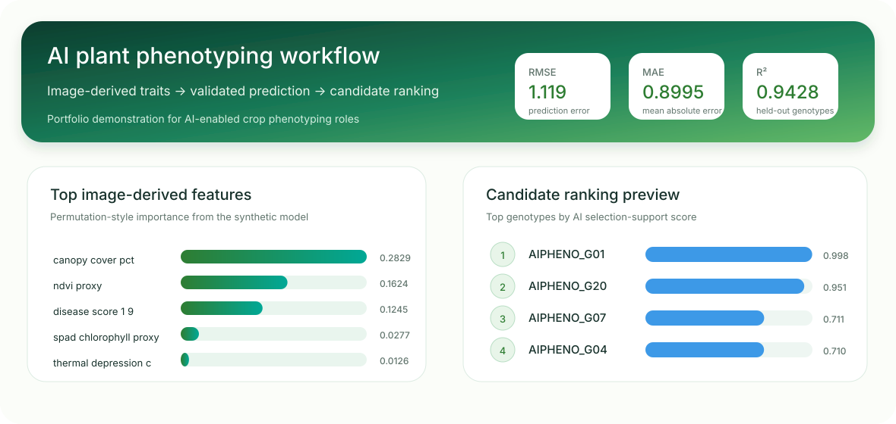
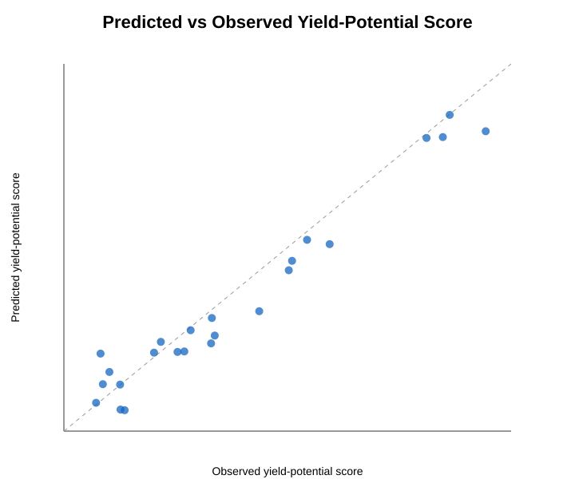
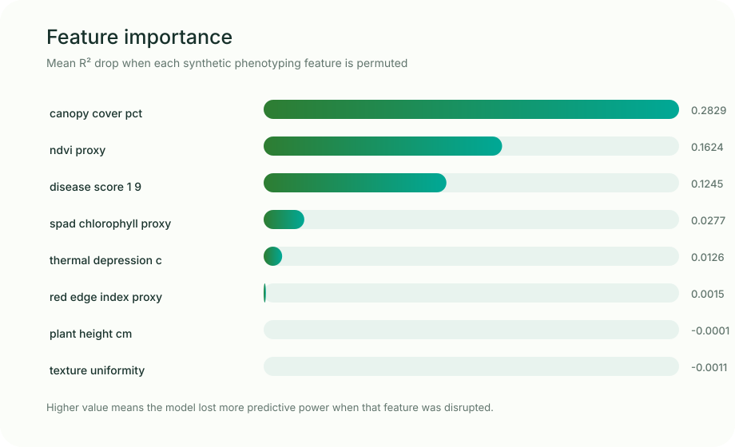
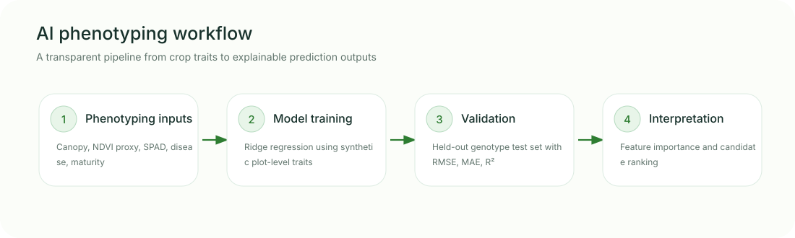

# AI Plant Phenotyping Workflow in Python


A reproducible demonstration workflow for AI-assisted plant phenotyping using synthetic image-derived and field-derived traits.

This repository does **not** claim real UAV/image-processing experience. Instead, it shows a safe and transparent starting point for AI-based phenotyping: organizing plot-level traits, training a simple predictive model, validating it on held-out genotypes, and explaining which phenotyping features contribute most to prediction.

## Why this repository exists

AI-based phenotyping roles often require researchers to connect plant/crop biology with reproducible data workflows. This repository demonstrates:

- structured phenotyping data organization
- train/test split by genotype to reduce leakage
- simple machine-learning prediction of yield-potential score
- model evaluation using RMSE, MAE, and R²
- permutation-style feature importance
- candidate genotype ranking from predicted performance
- model card and limitation reporting

## Repository structure

```text
ai-plant-phenotyping-workflow-python/
├── data/
│   └── synthetic_image_derived_phenotyping.csv
├── docs/
│   └── model_card.md
├── outputs/
│   ├── feature_importance.csv
│   ├── feature_importance.svg
│   ├── model_coefficients.csv
│   ├── model_metrics.json
│   ├── portfolio_overview.svg
│   ├── predictions.csv
│   ├── predicted_vs_observed.svg
│   ├── workflow_diagram.svg
│   └── top_candidate_genotypes.csv
├── reports/
│   └── ai_phenotyping_report.md
├── scripts/
│   ├── ai_phenotyping_workflow.py
│   └── make_portfolio_visuals.py
├── LICENSE
└── README.md
```

## Features used

The synthetic dataset represents plot-level phenotyping variables that could be derived from field observations or imaging pipelines:

- canopy cover
- NDVI proxy
- red-edge index proxy
- canopy texture uniformity
- thermal depression proxy
- plant height
- SPAD chlorophyll proxy
- disease score
- days to maturity

## How to run

```bash
python scripts/ai_phenotyping_workflow.py
```

Only Python and NumPy are required.

## Example outputs

## Visual portfolio preview



## Model validation



## Feature importance



## Workflow diagram



These visuals are generated from the synthetic output tables using `scripts/make_portfolio_visuals.py`, so the presentation layer is reproducible rather than manually assembled.

## Result snapshot

Held-out genotype test-set performance:

| Metric | Value |
|---|---:|
| RMSE | 1.119 |
| MAE | 0.8995 |
| R² | 0.9428 |

Top variables contributing to the prediction in this synthetic example:

| Rank | Feature | Mean R² drop |
|---:|---|---:|
| 1 | canopy cover | 0.2829 |
| 2 | NDVI proxy | 0.1624 |
| 3 | disease score | 0.1245 |

## What this demonstrates for postdoctoral roles

This repository is designed to show readiness for AI-enabled plant phenotyping roles where the researcher must:

- translate field/crop traits into analyzable data
- prevent leakage by validating across held-out genotypes
- explain model outputs rather than treating AI as a black box
- prepare reproducible outputs that can feed manuscripts, reports, or breeding decisions

## Background references

- AI in plant phenotyping and phenomics: [Review: Application of Artificial Intelligence in Phenomics](https://pmc.ncbi.nlm.nih.gov/articles/PMC8271724/)
- Model explanation approach: [scikit-learn permutation feature importance](https://scikit-learn.org/stable/modules/permutation_importance.html)

## Important limitation

This is a portfolio demonstration using synthetic data. It is not a deep-learning image segmentation model, not a UAV-processing pipeline, and not a real crop recommendation. It is designed to show the first AI/ML layer that can sit after phenotyping features have been extracted.

## Author

Mokkala Siva Prasad  
Vegetable Science | Plant Breeding | Field Phenotyping | AI-supported Crop Improvement  
GitHub: https://github.com/Siva-ghub5123
